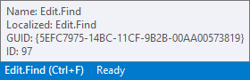
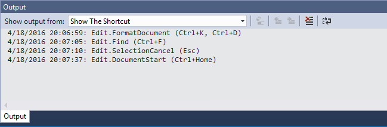

# Learn the Shortcut

Download this extension from the [VS Gallery](https://visualstudiogallery.msdn.microsoft.com/29f07f2c-68aa-47fa-b1c3-48065209b110)
or get the [CI build](http://vsixgallery.com/extension/9da28329-f9d5-4f18-91c3-d3285b103d1a/).

---------------------------------------

Shows how easy you can make the same action using only the
keyboard. Displays the keyboard shortcut for any command
that you execute to help you learn the shortcuts you need
the most.

It is also helpful for presentations where you want to display
to the audience what keyboard shortcuts you are using.

See the [changelog](CHANGELOG.md) for changes and roadmap.

## Features

- Displays the keyboard shortcut in the status bar
- Auto-hides the shortcut after 5 seconds (default setting)
- Doesn't show when a command was invoked by a shortcut
- Keeps a log in a separate Output Window pane

When a command is invoked from a button click (such as
*Edit -> Find and Replace -> Quick Find*) and there is a
keyboard shortcut bound to that command, that keyboard
shortcut will be displayed in the status bar.

### Status bar
By default, the keyboard shortcuts are logged to the status
bar for 5 seconds.

In the settings you can set the timeout to be zero, which
will persist the status bar indicator until a new shorcut
is displayed.

A tooltip can be enabled in the settings to give more
information about the command that was executed when the
mouse hovers over the status bar.

This can be helpful to anyone trying to automate Visual Studio.

When the tooltip is visible and you click the status bar
indicator, the content of the tooltip is copied to the
clipboard.

### Output Window
Every time a shortcut is displayed on the status bar, it is
also logged in the Output Window. This makes it easy to
go back in history to find any command that was executed
earlier.

This can be disabled in the settings.

### Settings
You can modify all the settings under **Tools -> Options**

## Contribute
Check out the [contribution guidelines](CONTRIBUTING.md)
if you want to contribute to this project.

For cloning and building this project yourself, make sure
to install the
[Extensibility Tools 2015](https://visualstudiogallery.msdn.microsoft.com/ab39a092-1343-46e2-b0f1-6a3f91155aa6)
extension for Visual Studio which enables some features
used by this project.

## License
[Apache 2.0](LICENSE)