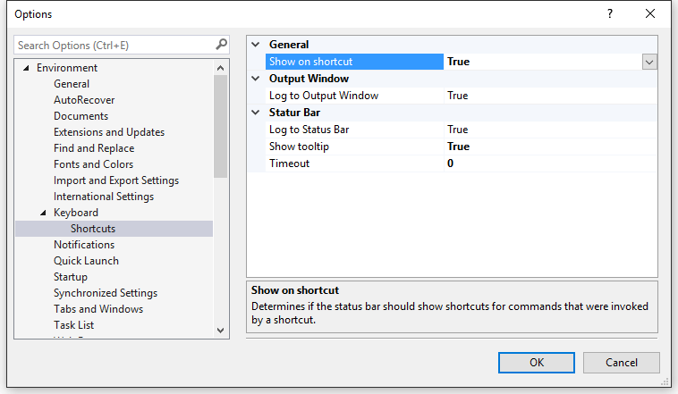

# Show The Shortcut

Download this extension from the [VS Gallery](https://visualstudiogallery.msdn.microsoft.com/29f07f2c-68aa-47fa-b1c3-48065209b110)
or get the [CI build](http://vsixgallery.com/extension/9da28329-f9d5-4f18-91c3-d3285b103d1a/).

---------------------------------------

Shows the keyboard shortcut for any command that you execute
to help you learn the shortcuts you use the most.

It is also helpful for presentations where you want to display
what keyboard shortcuts you are usign to the audience.

See the [changelog](CHANGELOG.md) for changes and roadmap.

## Features

- Displays the keyboard shortcut in the status bar
- Auto-hides the shortcut after 5 seconds (default setting)
- Doesn't show when a command was invoked by a shortcut

When a command is invoked from a button click (such as
*Edit -> Find and Replace -> Quick Find*) and there is a
keyboard shortcut bound to that command, that keyboard
shortcut will be displayed in the status bar.

### Settings

## Contribute
Check out the [contribution guidelines](CONTRIBUTING.md)
if you want to contribute to this project.

For cloning and building this project yourself, make sure
to install the
[Extensibility Tools 2015](https://visualstudiogallery.msdn.microsoft.com/ab39a092-1343-46e2-b0f1-6a3f91155aa6)
extension for Visual Studio which enables some features
used by this project.

## License
[Apache 2.0](LICENSE)